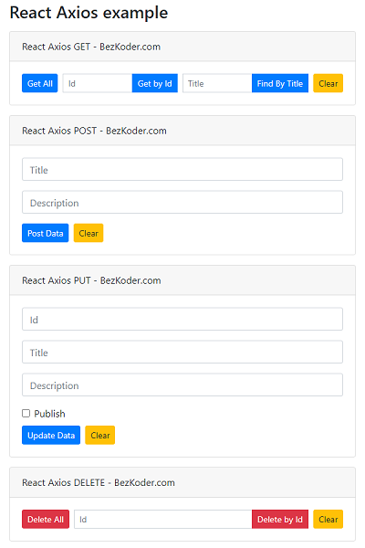

# React Axios example with Rest API

React Client with Axios to make CRUD requests to Rest API in that:

- React Axios GET request: get all Tutorials, get Tutorial by Id, find Tutorial by title
- React Axios POST request: create new Tutorial
- React Axios PUT request: update an existing Tutorial
- React Axios DELETE request: delete a Tutorial, delete all Tutorials

For instruction, please visit:
> [React Axios example - Get/Post/Put/Delete with Rest API](https://www.bezkoder.com/react-axios-example/)

Related Posts:
> [React Fetch example - Get/Post/Put/Delete with Rest API](https://www.bezkoder.com/react-fetch-example/)

> [React + Axios: CRUD example to consume Web API](https://www.bezkoder.com/react-crud-web-api/)

> [React Table example: CRUD App with react-table v7](https://www.bezkoder.com/react-table-example-hooks-crud/)

Using Material UI instead of Bootstrap:

> [React Material UI examples with a CRUD Application](https://www.bezkoder.com/react-material-ui-examples-crud/)

More Practice:

> [React Pagination example](https://www.bezkoder.com/react-pagination-material-ui/)

> [React File Upload example](https://www.bezkoder.com/react-file-upload-axios/)

> [React JWT Authentication & Authorization example](https://www.bezkoder.com/react-jwt-auth/)

> [React + Redux: JWT Authentication & Authorization example](https://www.bezkoder.com/react-redux-jwt-auth/)

Fullstack with Node Express:

> [React + Node Express + MySQL](https://www.bezkoder.com/react-node-express-mysql/)

> [React + Node Express + PostgreSQL](https://www.bezkoder.com/react-node-express-postgresql/)

> [React + Node Express + MongoDB](https://www.bezkoder.com/react-node-express-mongodb-mern-stack/)

Fullstack with Spring Boot:

> [React + Spring Boot + MySQL](https://www.bezkoder.com/react-spring-boot-crud/)

> [React + Spring Boot + PostgreSQL](https://www.bezkoder.com/spring-boot-react-postgresql/)

> [React + Spring Boot + MongoDB](https://www.bezkoder.com/react-spring-boot-mongodb/)

Fullstack with Django:

> [React + Django Rest Framework](https://www.bezkoder.com/django-react-axios-rest-framework/)

Serverless:

> [React Firebase CRUD App with Realtime Database](https://www.bezkoder.com/react-firebase-crud/)

> [React Firestore CRUD App example | Firebase Cloud Firestore](https://www.bezkoder.com/react-firestore-crud/)

Integration (run back-end & front-end on same server/port)

> [How to integrate React with Spring Boot](https://www.bezkoder.com/integrate-reactjs-spring-boot/)

> [Integrate React with Node Express on same Server/Port](https://www.bezkoder.com/integrate-react-express-same-server-port/)

This project was bootstrapped with [Create React App](https://github.com/facebook/create-react-app).
